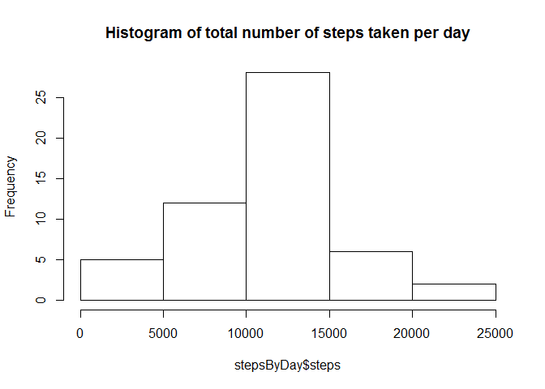
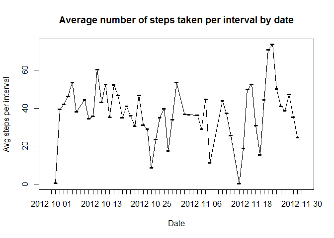
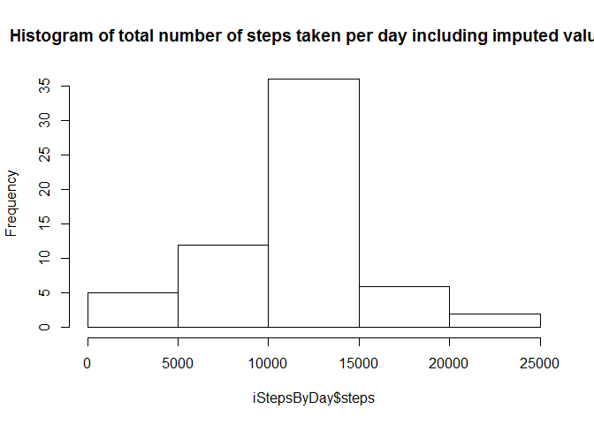

# Reproducible Research: Peer Assessment 1

## Loading and preprocessing the data

```r
setwd("~/GitHub/RepData_PeerAssessment1")
unzip("activity.zip")
act<-read.csv("activity.csv",na.strings = "NA") 
zAct<-subset(act,!is.na(act$steps)==TRUE)
```

## Histogram of the total number of steps taken each day

```r
stepsByDay<-aggregate(steps ~ date, zAct, sum)
hist(stepsByDay$steps, main = "Histogram of total number of steps taken per day")
```



## What is mean total number of steps taken per day?
### Mean and median number of steps taken each day

```r
mean(stepsByDay$steps)
```

```
## [1] 10766.19
```

```r
median(stepsByDay$steps)
```

```
## [1] 10765
```

## What is the average daily activity pattern?
### Time series plot of the average number of steps taken

```r
zAct$dt<-paste(zAct$date,zAct$interval)
avgStPerIntByDay<-aggregate(steps ~ date, zAct, mean)
plot(avgStPerIntByDay$date,avgStPerIntByDay$steps,type="n", xlab="Date",
     ylab="Avg steps per interval")
lines(avgStPerIntByDay$date,avgStPerIntByDay$steps)
title(main = "Average number of steps taken per interval by date")
```



### The 5-minute interval that, on average, contains the maximum number of steps

```r
avgStByInt<-aggregate(steps ~ interval, zAct, mean)
subset(avgStByInt,avgStByInt$steps==max(avgStByInt$steps))
```

```
##     interval    steps
## 104      835 206.1698
```

## Imputing missing values
### Calculate and report the total number of missing values in the dataset (i.e. the total number of rows with NAs)

```r
sum(is.na(act$steps))
```

```
## [1] 2304
```

### Code to describe and show a strategy for imputing missing data
#### This implementation uses the mean for for each 5-minute interval (calculated above) to "fill in the blanks".


```r
iAct<-act
iAct$steps[is.na(act$steps) & iAct$interval==avgStByInt$interval]<-avgStByInt$steps
```

##### Verification: This is not required, but I found it helpful...
Echo row 1 (originally NA) and row 927 (originally valued) from 
the before and after dataframes, act and iAct, respectively, to verify that the new values were added properly without corruptint the original values.


```r
act[c(1,927),]
```

```
##     steps       date interval
## 1      NA 2012-10-01        0
## 927     7 2012-10-04      510
```

```r
iAct[c(1,927),]
```

```
##        steps       date interval
## 1   1.716981 2012-10-01        0
## 927 7.000000 2012-10-04      510
```
### Create a new dataset that is equal to the original dataset but with the missing data filled in.


```r
write.csv(iAct,"imputed_activity.csv")
```
### Histogram of the total number of steps taken each day after missing values are imputed

```r
iStepsByDay<-aggregate(steps ~ date, iAct, sum)
hist(iStepsByDay$steps, main = "Histogram of total number of steps taken per day including imputed values")
```



### Mean and median number of steps taken each day with imputed values compared with the original mean and median
#### Original mean and median

```r
mean(stepsByDay$steps)
```

```
## [1] 10766.19
```

```r
median(stepsByDay$steps)
```

```
## [1] 10765
```

#### "Imputed" mean and median

```r
mean(iStepsByDay$steps)
```

```
## [1] 10766.19
```

```r
median(iStepsByDay$steps)
```

```
## [1] 10766.19
```

1. Do these values differ from the estimates from the first part of the assignment? 

    _By using the "interval mean" strategy, the resulting mean is exactly equal to the original mean and the median values are very close._

2. What is the impact of imputing missing data on the estimates of the total daily number of steps?

    _Negligible._ 

##### NOTE: using the median for each interval rather than the mean produced a dramtically different result.

## Are there differences in activity patterns between weekdays and weekends?
### _Yes_ 

_- Early morning:      weekday activity > weekend activity_

_- Later in the day:   weekend activity > weekday activity_

_During the week, the level of activity early in the morning is elevated compared with the correspondng morning intervals on the weekends. As the day progresses, the weekday activity is lower than the corresponding intervals during the weekend._
    
### Panel plot comparing the average number of steps taken per 5-minute interval across weekdays and weekends

1. Create a new factor variable in the dataset with two levels -- "weekday" and "weekend" indicating whether a given date is a weekday or weekend day.

```r
iAct$dowFactor<-"weekday"
iAct$dowFactor[weekdays(as.Date(as.character(iAct$date)),TRUE) %in% c("Sat", "Sun") ]<-"weekend"
iAct$dowFactor <- as.factor(iAct$dowFactor)
```
2. Panel plot containing a time series plot (i.e. type = "l") of the 5-minute interval (x-axis) and the average number of steps taken, averaged across all weekday days or weekend days (y-axis). 

```r
require(lattice)
wAct<-aggregate(steps ~ dowFactor + interval, iAct, mean)
with(wAct,
xyplot(steps~interval|factor(dowFactor),
       type='l',layout=c(1,2), 
       xlab='Interval',ylab='Number of Steps')
)
```


